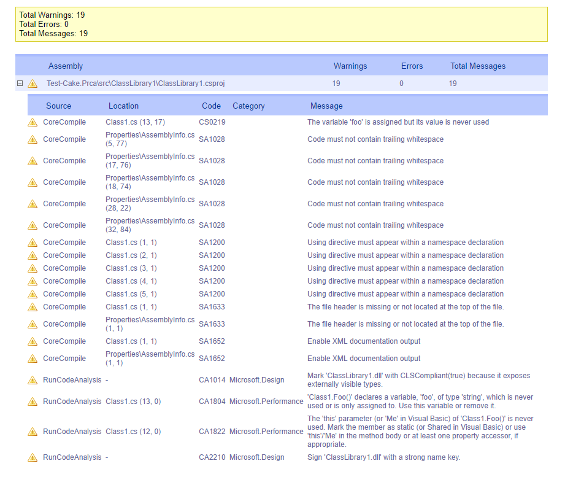

This report can be generated from a MsBuild log file genereated by the [XmlFileLogger] from the MSBuild Extension Pack
and shows all warnings and errors reported in the log file grouped by assembly.

[XmlFileLogger]: http://www.msbuildextensionpack.com/help/4.0.5.0/html/242ab4fd-c2e2-f6aa-325b-7588725aed24.htm
